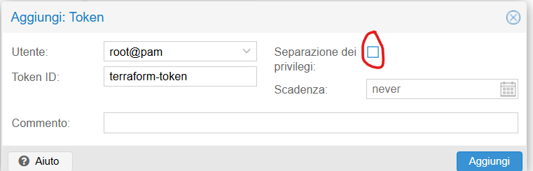
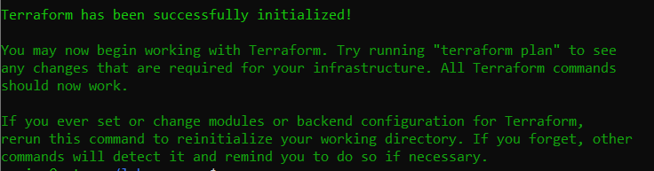
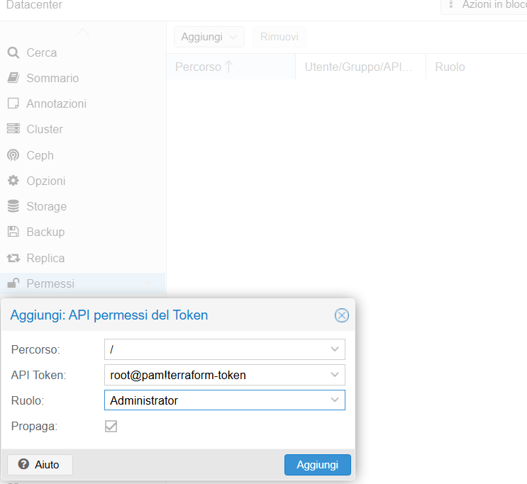

# Infrastructure as Code: Terraform Setup

To automate the creation of my virtual environment, I implemented Infrastructure as Code (IaC) using Terraform. This allowed me to clone and configure multiple VMs from my Ubuntu template with a single command.

1. **Terraform Installation** (WSL): I installed Terraform within my WSL Ubuntu environment to manage the infrastructure as code. I added the official HashiCorp GPG key and repository to ensure a secure and up-to-date installation.

```bash
#Add HashiCorp GPG key
wget -O- https://apt.releases.hashicorp.com/gpg | sudo gpg --dearmor -o /usr/share/keyrings/hashicorp-archive-keyring.gpg

#Add the official repository
echo "deb [signed-by=/usr/share/keyrings/hashicorp-archive-keyring.gpg] https://apt.releases.hashicorp.com $(lsb_release -cs) main" | sudo tee /etc/apt/sources.list.d/hashicorp.list

#Install Terraform
sudo apt update && sudo apt install terraform -y
```

2. **Verification**: I confirmed the successful installation by checking the version:

```bash
terraform -version
#Output: Terraform v1.14.3 on linux_amd64
```

## Dedicated API Token in Proxmox


I created a dedicated API Token in Proxmox (Datacenter -> Permissions -> API Tokens). Without this, Terraform does not have permission to access the server.

- Add.
- User: root@pam
- Token ID: terraform-token
- **Privilege Separation**: I deselected this option to simplify permission management for now.
- I clicked on Add again.

**Important: COPY the Secret GENERATED. It is only shown once, so I saved it in a temporary text file on my Windows machine.**
This allows Terraform to communicate with the Proxmox API securely without needing the master root password.

## Project Folder Preparation

**Inside my WSL environment(Ubuntu), I organized the project workspace and initialized the Terraform providers:**

```bash
mkdir ~/lab-proxmox && cd ~/lab-proxmox
touch provider.tf main.tf vars.tf
terraform init                     #Downloads the telmate/proxmox provider
```

(The green text in the output means it worked!!)

In the terminal, inside the folder containing the files(lab-proxmox), I runned this sequence:

- **terraform init**: Downloads the "drivers" (plugins) needed to talk to Proxmox.
- **terraform plan**: It reads the project and tells you what it costs and what it breaks.
- **terraform apply**: Physically executes the changes on Proxmox.

## Permission Management

On the Proxmox GUI, I configured the following permissions:

- root@pam: I ensured permissions for / were assigned to the admins group.
- API Token Permissions: I clicked Add and configured the token:
- Token ID: terraform-token
- User: root@pam
- Role: I assigned Administrator permissions on /.

## Defining the Infrastructure (main.tf)
I wrote the configuration to deploy two primary nodes: **the Jenkins CI server** and the **App Runtime agent**. **Both were cloned from my ubuntu-template (ID 100) and configured via Cloud-Init**.

I used nano provider.tf to input the following configuration:

```bash
nano provider.tf
```

```bash
terraform {
  required_providers {
    proxmox = {
      source  = "telmate/proxmox"
      version = "2.9.11"
    }
  }
}

provider "proxmox" {
  pm_api_url      = "https://********IP-SERVER-PROXMOX:8006/api2/json"
  pm_user         = "enrico@pve"
  pm_password     = "password"
  pm_tls_insecure = true
  pm_parallel     = 1

}
```

```bash
nano main.tf
```

```bash
# --- VM 1: JENKINS ---
resource "proxmox_vm_qemu" "jenkins_vm" {
  name        = "jenkins-ci"
  target_node = "Proxmox"
  vmid        = 101
  clone       = "ubuntu-template"         #Needs the template name
  full_clone  = true
  scsihw      = "virtio-scsi-pci"

  cores   = 2
  memory  = 4096
  balloon = 0
  agent   = 0

  disk {
    slot    = 0
    size    = "20G"
    type    = "scsi"
    storage = "local-lvm"
  }
  network {
    model  = "virtio"
    bridge = "vmbr0" 
  }
  os_type   = "cloud-init"
  ipconfig0 = "ip=192.168.1.91/24,gw=192.168.1.1"

  ciuser     = "enrico"
  sshkeys    = <<EOF
  ssh-ed25519**********chiave-ssh*************
  EOF
}

# --- VM 2: RUNTIME ---
resource "proxmox_vm_qemu" "runtime_vm" {
  name        = "app-runtime"
  target_node = "Proxmox"
  vmid        = 102
  clone       = "ubuntu-template"
  full_clone  = true
  scsihw      = "virtio-scsi-pci"

  cores   = 2
  memory  = 4096
  agent   = 0

  disk {
    slot    = 0      
    size    = "20G"
    type    = "scsi"       
    storage = "local-lvm"
  }
  network {
    model  = "virtio"
    bridge = "vmbr0"         #Check standard bridge name
  }
  os_type   = "cloud-init"
  ipconfig0 = "ip=192.168.1.93/24,gw=192.168.1.1"

  ciuser     = "enrico"
  sshkeys    = <<EOF
  ssh-ed25519**********chiave-ssh*************
  EOF
}
```
**Testing main.tf**
```bash
terraform plan    # press yes!
```

**I deployed the two VMs:**
```bash
terraform apply
```
As soon as I launched the first apply, Terraform created a file called **terraform.tfstate**. This file is Terraform's "memory". If I change the number of cores in main.tf tomorrow and run apply again, Terraform will read the state, see that the VM already exists, and modify only the cores instead of recreating it.
**A small warning**: The only thing Terraform does not do is configure what is inside the VM (installing databases, apps, or complex system files) after it is powered on. I will use Ansible for that.
**Troubleshooting**: If problems arise, I use this command to see the logs

```bash
TF_LOG=INFO terraform apply
```
## Troubleshooting the Proxmox Provider

1. **Handling Provider Crashes**: The proxmox provider can be unstable during long operations. I increased the timeouts to prevent Terraform from killing the process while Proxmox was still busy cloning large VM disks.

I can add multiple keys for the same user. The authorized_keys file supports an unlimited number of entries, allowing me to authorize both my WSL and Windows environments simultaneously.
3. **Solving Authentication Errors**: I initially faced 401 Unauthorized errors when using the standard root@pam password. I mitigated this by switching to API Token authentication with a native Proxmox user (enrico@pve).
4. **Ensuring Stability**: By tuning these settings and assigning the PVEAdmin role directly to the API token, I transformed an unstable, error-prone connection into a reliable automation workflow.

I encountered and mitigated instability issues in the Proxmox Terraform provider by tuning timeouts and switching to API token authentication.
What I did: I injected only one public key into the VM template (likely the WSL one) via Cloud-Init.

The Result:

- WSL Access: Works (uses the correct key).
- Windows CMD Access: Fails (tries to use a different, unauthorized key).

**Option 1: Adding the Windows Key to the VM**
nano ~/.ssh/authorized_keys
**Alternatively, I can tell Windows to use the specific key stored within the WSL filesystem by using the -i (identity file) flag. This avoids the need to manage multiple keys.**
ssh -i \\wsl$\Ubuntu\home\user\.ssh\id_ed25519 user@192.168.1.*

## SSH Hardening: Disabling Password Authentication
To finalize the security of my VMs and enforce key-based access, I disabled password logins. This ensures that only clients with a verified SSH key can access the system.

**I edited the SSH daemon configuration file:**
```bash
sudo nano /etc/ssh/sshd_config
```
**Inside the file, I applied the following changes:**

- PasswordAuthentication set to no.
- PubkeyAuthentication set to yes.

**After saving the file, I restarted the SSH service to apply the new security settings:**

```bash
sudo systemctl restart ssh
```


