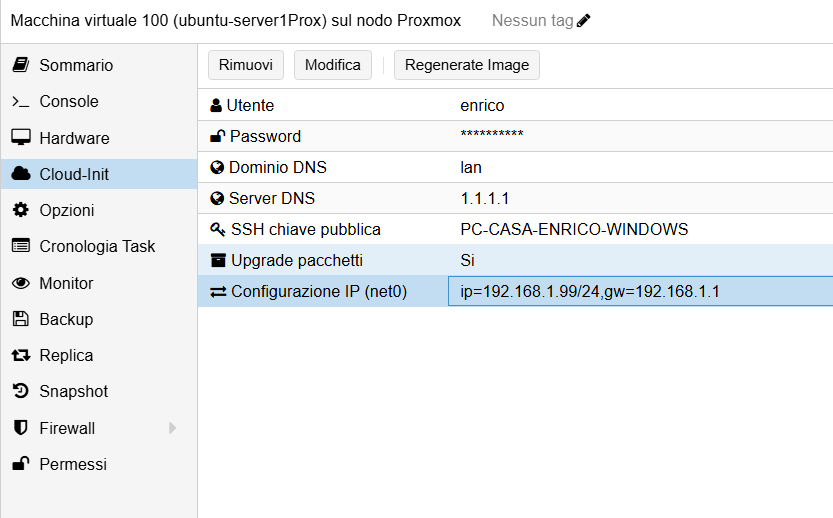
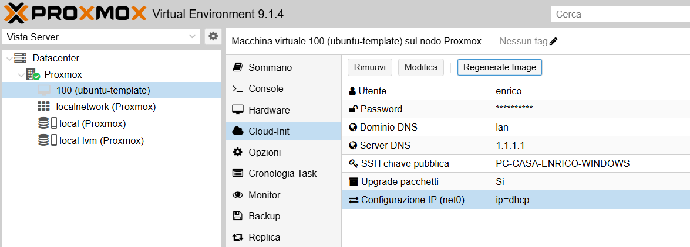

## Proxmox Installation & Initial Setup
I installed Proxmox using a USB flash drive containing the ISO image.

1. **Hardware Boot**: I accessed the BIOS (F1) and set the USB drive as the primary boot device.
2. **System Configuration**: I proceeded with the graphical installation mode, where I assigned a static IP address, defined the system hostname, and configured the root password.
3. **Repository Cleanup**: After the first boot, I executed apt update and apt upgrade. To resolve errors caused by the lack of a commercial license, I removed the enterprise-only repository entries from both /etc/apt/sources.list.d/ceph.sources and /etc/apt/sources.list.d/pve-enterprise.sources.
4. **No-Subscription Repository**: I configured the community-supported repository by creating a new source file (/etc/apt/sources.list.d/pve-no-subscription.sources) and added the appropriate repository URL to enable system updates.
```bash
nano /etc/apt/sources.list.d/pve-no-subscription.sources 
```

```bash
Types: deb
URIs: http://download.proxmox.com/debian/pve
Suites: trixie
Components: pve-no-subscription
Architectures: amd64
```
## User Management & VM Template Creation

1. **User synchronization**: I created a new system user using the adduser command and aligned it with the Proxmox Web GUI (accessible via https://[IP]:8006). By replicating the username and password in the Proxmox authentication system, I ensured consistent permissions across both the OS and the virtualization management layer.
2. **VM provisioning & network setup**: I provisioned a base Ubuntu Server VM, allocating 1 CPU core and 2 GB of RAM. Initially, I performed a manual network configuration to verify connectivity within the lab environment before moving toward full automation.
<br>
.png)
<br>

3. **Cloud-Init image acquisition**: I downloaded the Ubuntu Cloud-Init (cloudimg) ISO directly to the local Proxmox storage to serve as the foundation for my automation templates. <br>


.png)

## Automating with Cloud-Init

I implemented a **Cloud-Init drive**, which is the essential for my Terraform and Ansible automation workflow. Without a Cloud-Init drive, any VM created by Terraform would remain stuck at the initial login or installation screen, requiring manual intervention. By integrating Cloud-Init, I enabled Terraform to automatically "inject" critical configurations during the first boot, including:

- **SSH Key injection**: I implemented this for secure, passwordless remote access, allowing tools like Ansible to automate tasks without manual intervention.
- **User account & password**: I configured a primary user with a password as a fallback for local console access and to authorize administrative (sudo) operations.
- **Networking**: I assigned a static IP address to ensure the VM is reachable at a predictable address.

<br>

 <br>
<br>

## Template Creation Commands
I used the QEMU Manager (qm)(the native Proxmox CLI utility), to provision the base templates. This approach allowed me to script the initial VM configuration, ensuring a repeatable and consistent baseline for the subsequent Terraform-led automation.

```bash
#Creat the VM template shell
qm create 100 --name ubuntu-template --memory 2048 --net0 virtio,bridge=vmbr0 --scsihw virtio-scsi-pci          

#Define variables for the import process
VMID=100
STORAGE=local-lvm
IMG=/var/lib/vz/template/iso/noble-server-cloudimg-amd64.img

#Import the disk image and set up the Cloud-Init drive
qm set $VMID --scsi0 ${STORAGE}:0,import-from=$IMG
qm set $VMID --ide2 ${STORAGE}:cloudinit
qm set $VMID --boot order=scsi0
qm set $VMID --serial0 socket --vga serial0
```

## Workstation Setup & SSH Key Generation

1. **WSL Installation**: I installed the Windows Subsystem for Linux (WSL) on my Windows machine via PowerShell to create a native Linux environment for my DevOps tools.

```bash
wsl --install
```

2. **SSH Key Pair**: I generated a high-security ED25519(better than RSA) SSH key pair to establish a secure connection between my workstation and the lab environment.

```bash
ssh-keygen -t ed25519 -C "PC-HOME"       #-C is the label
```

3. **Display the public key to be copied**

```bash
cat ~/.ssh/id_ed25519.pub
```
### Command to remove a key if necessary in troubleshooting
```bash
ssh-keygen -R <ip>
```
4. **Key Management**: I copied the entire public key string, including the comment, to integrate it into the Cloud-Init configuration

## Cloud-Init Configuration & Template Conversion

1. **Cloud-Init Customization**: I configured the Cloud-Init parameters with my designated username, password, and the previously generated SSH key. I also set the DNS domain to .lan and the DNS server to 1.1.1.1.
2. **IP Assignment**: For the template baseline, I selected a DHCP to ensure maximum flexibility when cloning new instances.
<br>


<br>

NOTE: I configured the base template with a Dynamic IP (DHCP) to ensure it remains a generic and reusable 'gold image'. However, during the deployment phase, I used Terraform to inject Static IPs into each instance. This ensures that critical infrastructure components—like the Monitoring stack (.7) and the Jenkins Agent (.8) always reside at fixed addresses for reliable communication.

3. **Validation**: I performed a test boot of VM 100 to verify the settings. Once confirmed, I used the "Regenerate Image" function in the Proxmox UI to finalize the Cloud-Init drive.
4. **System Shutdown**: I safely powered down VM 100 to prepare it for conversion.
5. **Proxmox Template Conversion**: I converted the VM into a Proxmox Template.

**Result: The VM icon changed to the Template icon, and the "Start" button was disabled.** <br>
**Purpose**: This template now acts as a "gold image", ensuring that all future VMs are identical and ready for automation.

### Disable password auth access

sudo nano /etc/ssh/sshd_config


