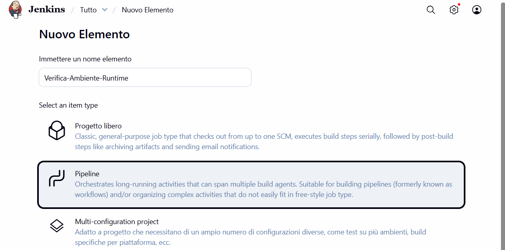
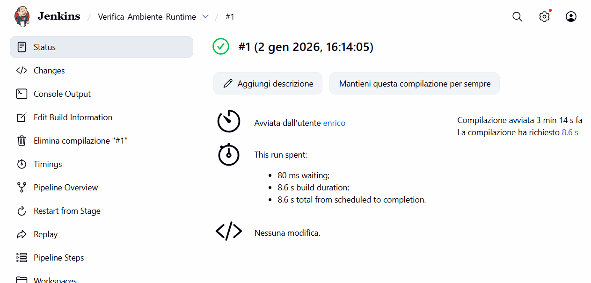
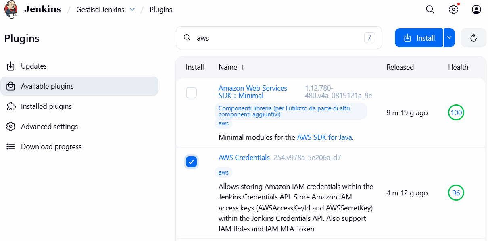
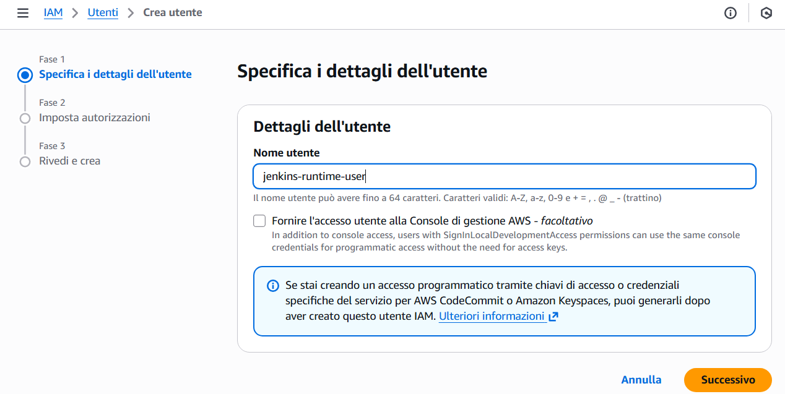
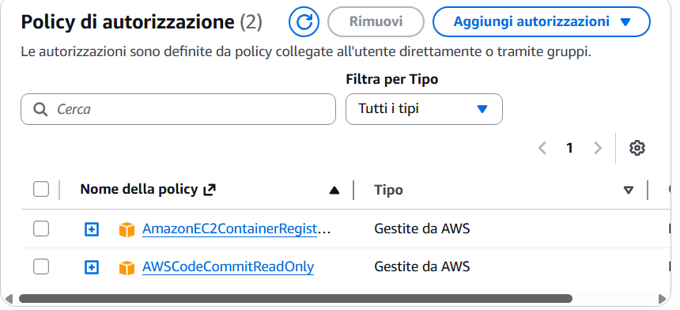
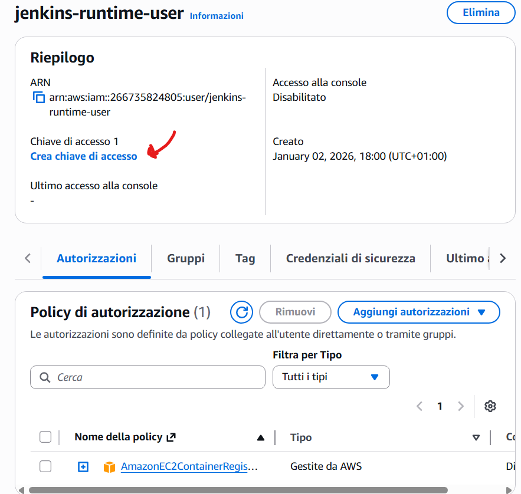
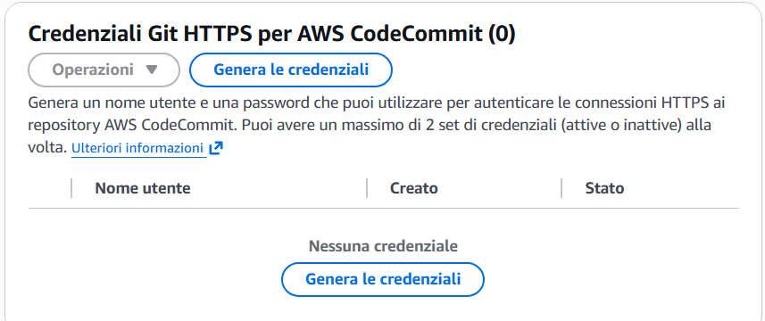
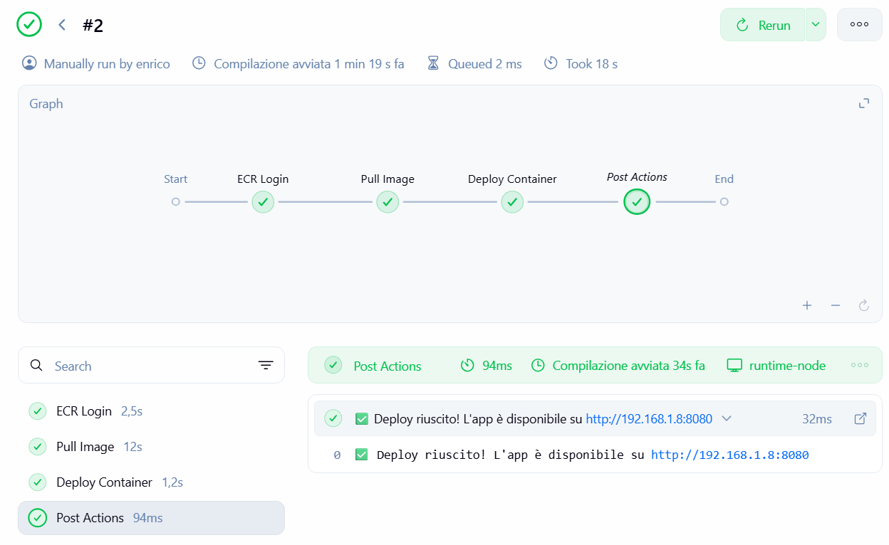

# Pipeline as Code (Jenkinsfile)
<br>
<br>

1. From the Jenkins dashboard  --> new element.
2. Create a Pipeline.
3. Name: Verifica-Ambiente-Runtime.
4. Select Pipeline and click OK.
5. scroll to the bottom to the Pipeline section and past a pipeline code like the one I used below:


**Testing the pipeline**
<br>

--------------------------------------------------------------------------------------------------------
```bash
pipeline {
    agent { label 'runtime' }

    stages {
        stage('Check Environment') {
            steps {
                echo 'Checking Docker and Java on the Runtime Node...'
                sh 'java -version'
                sh 'docker --version'
                sh 'hostname -I'
            }
        }
    }
}
```
Java is the core engine that allows Jenkins to "exist" and execute tasks on machine .8. If you remove Java, the node will immediately appear as Offline in the Jenkins UI.

## continuous deployment pipeline (CD)
Since the node is ready, we can create a pipeline that simulates a real deployment. This pipeline will clean up any old containers and launch a web application..

**Installing AWS CLI v2 on the Runtime Node**

To unpack the AWS installer, you need **unzip**. Run this on your node's terminal:

```bash
sudo apt update && sudo apt install unzip curl -y
```
## Download and Install AWS CLI v2
Copy and paste these three commands one at a time:

```bash
curl "https://awscli.amazonaws.com/awscli-exe-linux-x86_64.zip" -o "awscliv2.zip"  # Download the official package

unzip awscliv2.zip        # Extract the files

sudo ./aws/install        # Run the installation
```
**Verify the installation**
```bash
aws --version
```
You should see something like aws-cli/2.x.x. If you see this, your node is finally ready to communicate with ECR.<br>
**How the Pipeline works:**

- **ECR Login**: Your pipeline will use the aws ecr get-login-password command to authenticate Docker with AWS.
- **Image Pull**: Docker will download your specific image from your ECR repository.
- **Container Run**: The application will be launched directly on your runtime node.

## Creating a IAM user in my AWS account to obtain the secret access keys


**Install the AWS Plugin**

1. From the main Jenkins dashboard, click on the gear icon (Manage Jenkins)
2. Click on Plugins (or Manage Plugins).
3. Go to the Available plugins tab at the top..
4. In the search bar on the right, type: AWS Credentials.
5. Check the box for the AWS Credentials plugin (usually authored by CloudBees or the Jenkins Project).
6. Click the Install button.


## Generate access Key ID and secret Access Key.


1. Log in to the AWS Console and search for the IAM service.
2. In the left menu, click on Users and then on Create user.
3. Assign a name (e.g., jenkins-runtime-user). Do not select web console access; this user is only for programmatic access (API).
4. On the Set permissions screen, select Attach policies directly.
5. Search for and select the policy: **AmazonEC2ContainerRegistryReadOnly** and **AWSCodeCommittReadOnly**. This policy allows Jenkins to see and pull images and see the repository of code, but not to delete them or upload new ones, which increases security.
6. Complete the user creation.
7. Once the user is created, click on their name, go to the Security credentials tab, and click on Create access key.
8. Select the Command Line Interface (CLI) use case and proceed until you get the two codes.<br>

***********************************************************************************


## Saving the IAM user credentials in Jenkins Global Credentials

1. Go to Manage Jenkins > Credentials > System > Global credentials (unrestricted) > Add Credentials.
2. Type: AWS Credentials.
3. ID: aws-ecr-creds.
4. Description: A description of your choice (e.g., "Keys for AWS ECR").
5. Access Key ID: Paste the code starting with AKIA... that you got from AWS IAM.
6. Secret Access Key: Paste your long secret key.
7. Save the credentials.


## Creating a pipeline that pulls an image from my CodeCommit repo in AWS


Prepare the credentials for CodeCommit.
To allow Jenkins to read from CodeCommit, you need specific **Git credentials**:

1. Go to IAM in AWS > Users > select your jenkins-runtime user.
2. Go to the Security credentials tab.
3. Scroll down to **HTTPS Git credentials for AWS CodeCommit** and click on **Generate credentials**.
4. **Save the Username and Password**.
5. On Jenkins, add these credentials (Username with password type) with the ID **codecommit-creds**.

```bash
pipeline {
    agent { label 'runtime' }

    environment {
        // --- CONFIGURAZIONE AWS ---
        AWS_ACCOUNT_ID = '**********'
        AWS_REGION     = '****-****-1'
        REPO_NAME_ECR  = '********'
        CODECOMMIT_URL = 'https://git-codecommit.eu-************************'
        // --------------------------
        
        ECR_URL = "${AWS_ACCOUNT_ID}.dkr.ecr.${AWS_REGION}.amazonaws.com"
    }

    stages {
        stage('Checkout from CodeCommit') {
            steps {
                echo 'Download del codice sorgente da CodeCommit...'
                git url: "${CODECOMMIT_URL}", branch: 'main', credentialsId: 'codecommit-creds'
            }
        }

        stage('Unit Tests') {
            steps {
                echo 'Esecuzione test su codice sorgente...'
                sh '''
                    python3 -m venv venv
                    . venv/bin/activate
                    pip install -r requirements.txt
                    pytest tests
                '''
            }
        }

        stage('ECR Login') {
            steps {
                echo 'Autenticazione su AWS ECR...'
                withCredentials([[ $class: 'AmazonWebServicesCredentialsBinding', credentialsId: 'aws-ecr-creds' ]]) {
                    sh "aws ecr get-login-password --region ${AWS_REGION} | docker login --username AWS --password-stdin ${ECR_URL}"
                }
            }
        }

        stage('Pull & Scan Image') {
            steps {
                echo "Download immagine da ECR..."
                sh "docker pull ${ECR_URL}/${REPO_NAME_ECR}:latest"
                
                echo 'Scansione sicurezza con Trivy...'
                // Blocca la pipeline se trova vulnerabilità critiche nell'immagine
                sh "docker run --rm -v /var/run/docker.sock:/var/run/docker.sock aquasec/trivy image --severity HIGH,CRITICAL --exit-code 1 ${ECR_URL}/${REPO_NAME_ECR}:latest"
            }
        }

        stage('Deploy') {
            steps {
                echo 'Aggiornamento container sul nodo runtime...'
                sh "docker rm -f quiz-app-container || true"
                sh "docker run -d --name quiz-app-container -p 8080:5000 ${ECR_URL}/${REPO_NAME_ECR}:latest"
            }
        }
    }

    post {
        success {
            echo "Deploy completato con successo attingendo da CodeCommit ed ECR!"
        }
        failure {
            echo "Errore nella pipeline. Verifica se il fallimento è nei Test o nella Scansione Trivy."
        }
    }
}
```
 <br>

## Automation with SCM Polling

To achieve full automation,**the pipeline is configured with SCM Polling**. This allows Jenkins to autonomously monitor the AWS CodeCommit repository without requiring external webhooks.
**SCM Polling (Source Control Management Polling)** is a trigger mechanism used in CI/CD tools like Jenkins to automatically start a pipeline whenever a change is detected in the source code.

- Instead of waiting for the Git server (such as AWS CodeCommit or GitHub) to notify it, Jenkins takes the initiative.
- Jenkins periodically "interrogates" the repository at regular intervals.
- Commit Check: It asks the repository: "Are there any new commits since the last time I checked?".
- Automatic Trigger: If the answer is Yes, Jenkins downloads the code and starts the pipeline.
- Standby: If the answer is No, Jenkins does nothing and waits for the next scheduled interval.

**Polling** is configured using **cron syntax**. For example, the instruction **H/5 * * * * tells Jenkins to check the repository every 5 minutes. 
**Using the hash symbol (H) is a fundamental best practice for several reasons:**

- **Load Balancing**: It distributes requests over time instead of concentrating them all at once.
- **Stability**: It prevents the Jenkins VM from slowing down or crashing by avoiding too many simultaneous connections to AWS CodeCommit.
-------------------------------------------------------------------------------------------------------------------
### Security

- **Credential Secrecy**: Your AWS keys (AKIA...) never appear in the Jenkins logs or in the script. They are protected by the Credentials plugin, which masks them (you would only see **** in the logs).
- **Principle of Least Privilege**: The IAM user you created has ReadOnly permissions only. Even if someone were to steal those keys, they could only download images; they wouldn't be able to delete your databases or create expensive new machines on AWS.
- **Ephemeral Authentication**: By using get-login-password, you aren't saving the Docker password permanently on the disk. The login is only valid for that specific working session.

## Jenkins Pipeline Architecture & CD Implementation

**1. The Agent Model (Architecture)**
In my pipeline, I used agent { label 'runtime' }. This means the entire workflow runs on my worker VM (192.168.1.8) rather than the controller.
I chose not to have the controller "log in" via SSH to the server. That approach is fragile and requires open inbound ports.

My runtime VM runs a **Jenkins agent process**. It establishes an outgoing connection to the controller (pull model). This ensures a clean separation of roles: the Controller handles scheduling and UI, while the Agent handles execution and local resources (Docker socket, filesystem).

- Scalability: By using labels, I can easily add more runtime nodes in the future without changing my Jenkinsfile logic.

**2. Environment Configuration**
I defined an environment block to manage reusable variables:


```bash
environment {
    AWS_ACCOUNT_ID = '***********'
    AWS_REGION     = 'eu*******'
    REPO_NAME      = '*******'
    ECR_URL = "${AWS_ACCOUNT_ID}.dkr.ecr.${AWS_REGION}.amazonaws.com"
}
```
Using these variables allowed me to avoid hardcoding values, making the pipeline cleaner and much easier to maintain.

**3. Pipeline Stages**

**A. Checkout & Unit Tests**
First, I configured the pipeline to clone the repository from my AWS CodeCommit repo directly onto the runtime node. Once the code was available, I executed Unit Tests using pytest. I used a Python virtual environment to install dependencies and verify that the app returns a 200 OK status before moving forward.

B. **ECR Login**
I implemented the ECR Login stage using the aws-ecr-creds stored in Jenkins.

I used aws ecr get-login-password to retrieve a temporary token.
**Security: This avoids saving passwords in plain text and follows AWS best practices for ephemeral authentication.**

**C. Pull & Security Scan**

I pulled the latest image from my ECR repository. Before deployment, I added a security step: scanning the image with **Trivy**. This ensures that I am not deploying containers with known high-risk vulnerabilities. 
<br>
**I integrated Trivy into this workflow as I was already familiar with it, having used it for the same purpose in my previous DevOps project** 

https://github.com/Enrisox/Secure-Home-Lab-Docker/blob/main/docs/step12_HARDENING_CONTAINERS.md

**D. Idempotent Deployment**
I defined the Deploy stage:

```bash
sh "docker rm -f quiz-app-container || true"
sh "docker run -d --name quiz-app-container -p 8080:5000 ${ECR_URL}/${REPO_NAME}:latest"
```
I designed this stage to be **idempotent**: it automatically stops and removes any existing container before starting the new one. This ensures the system always reaches the desired state regardless of its starting condition.

In DevOps and automation, **Idempotence** is the property of an operation that can be applied multiple times without changing the result beyond the initial application.

1. **Predictability**: No matter how many times I trigger the pipeline, the final state of the Runtime node will be the same: one single instance of the application running on port 8080.
2. **Error Handling**: By using || true, I ensure that the script doesn't crash if the container isn't there (for example, during the very first deployment).
3. **Reliability**: It eliminates "configuration drift," ensuring that the environment always matches the specifications defined in my Jenkinsfile.


