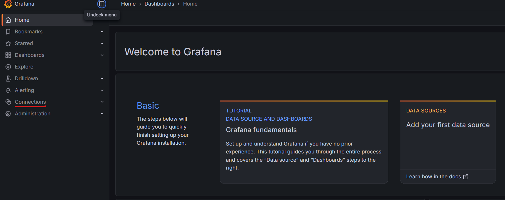
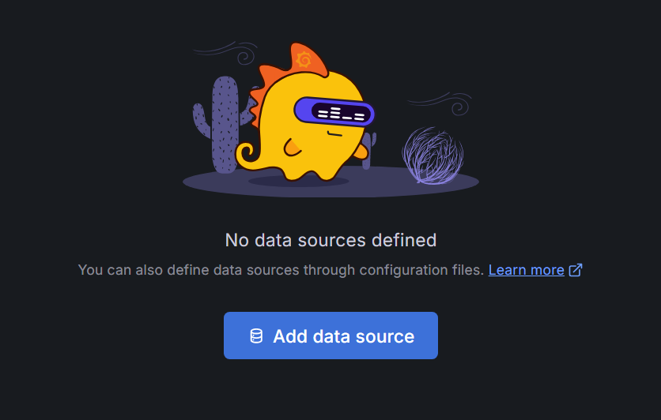
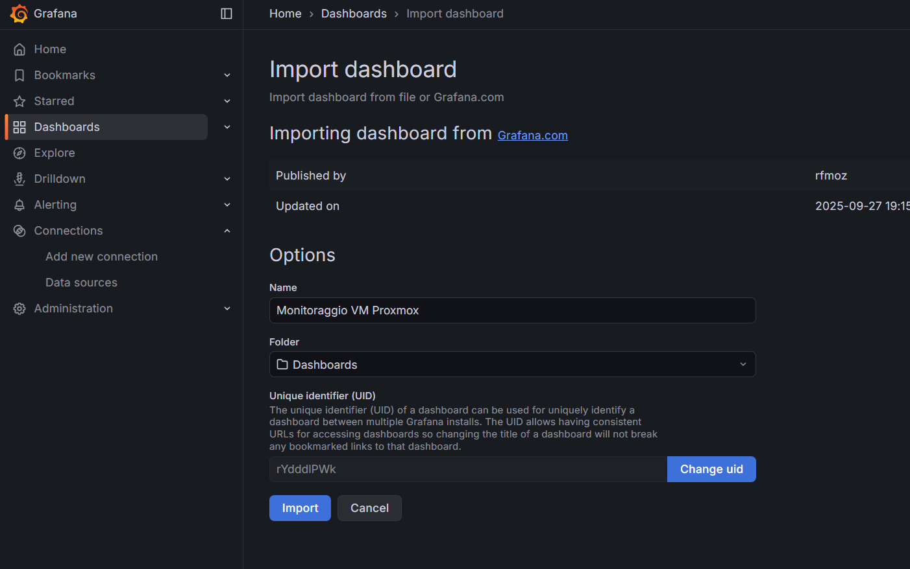
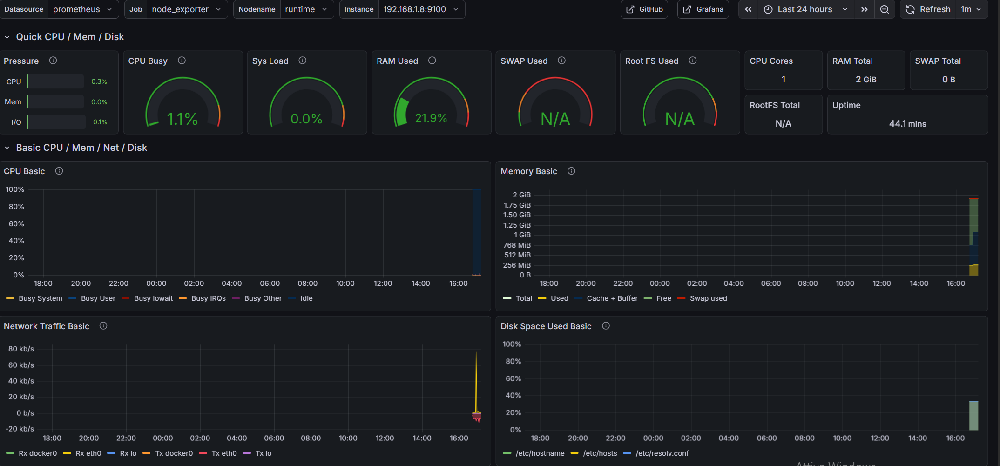

# Monitoring a VM with Prometheus and Grafana


**Prometheus: Time-Series Database (TSDB) & Scraper**
Prometheus is an open-source systems monitoring and alerting toolkit based on a Pull Model.

- Data Model: It stores data as Time-Series, identified by metric name and key/value pairs (labels).

**Architecture:**

- Scraper: It pulls metrics from HTTP endpoints (like 192.168.1.8:9100/metrics) at defined scrape_intervals.
- Storage: Uses a local TSDB (Time-Series Database) optimized for high-ingestion rates of timestamped data.
- PromQL: A functional query language that allows you to select and aggregate time-series data in real time.


**Grafana: Visualization & Observability Layer**
Grafana is a multi-platform open-source analytics and interactive visualization web application.

- Data Source Integration: It does not store data. It connects to backends like Prometheus, InfluxDB, or Elasticsearch via a Data Source plugin.
- Query Mapping: It sends PromQL queries to Prometheus, receives the raw time-series data, and renders it into Panels (Graphs, Gauges, Heatmaps).
- Dashboarding: It provides a unified UI to build complex dashboards that correlate data from multiple sources.

**It handles the presentation layer and user interface for observability.**

To monitor the health of my infrastructure, I organized the setup as follows:

- **VM Jenkins**: This is my "Command Center." Here, I will run **Prometheus** (the time-series database for metrics) and Grafana (the dashboard for visualization).

- **VM Runtime**: This is the "Source" I will install a container called **node-exporter** here, which monitors CPU, RAM, and Network usage.

## Installing the "Sensor" on the Runtime VM via Ansible

I am performing these steps from my PC Host using the (WSL)Ubuntu terminal, which acts as my Ansible Control Node.

First, I created a new playbook: 
```yaml
nano playbooks/monitoring.yml.
```
```yaml
- name: Install Monitoring Sensors
  hosts: runtime_group
  become: true
  tasks:
    - name: Run Node Exporter Container
      community.docker.docker_container:
        name: node-exporter
        image: prom/node-exporter:latest
        state: started
        restart_policy: always
        published_ports:
          - "9100:9100"
        network_mode: host
```

2. Then I ran the command to install the sensor on the Runtime VM (102):
   
```yaml
ansible-playbook playbooks/monitoring.yml
```

3. After the installation, I verified that the metrics were being exposed at:
http://192.168.1.8:9100/metrics

## Install Prometheus + Grafana on the CI VM (101)

Now I need to make sure that VM 101 reads these data from VM 102 and displays them in a chart.

I proceeded by creating a configuration file (and the related playbook) to set everything up on VM 101.

First, I created the **prometheus.yml** configuration file:

```yaml
nano ~/lab-ansible/prometheus.yml
```

```yaml
global:
  scrape_interval: 15s # Sampling frequency

scrape_configs:
  - job_name: 'node_exporter'
    static_configs:
      - targets: ['192.168.1.8:9100']
```

## Let's create the Playbook playbooks/setup_monitoring_server.yml
This playbook will perform three main tasks on the Jenkins VM (101):

1. Create a directory for the configuration data.
2. Upload the prometheus.yml file that I just created.
3. Start the Prometheus and Grafana containers.

```yaml
nano playbooks/setup_monitoring_server.yml
```

```yaml
---
- name: Setup Monitoring Server (Prometheus & Grafana)
  hosts: jenkins
  become: true
  tasks:
    - name: Create Prometheus config directory
      ansible.builtin.file:
        path: /etc/prometheus
        state: directory
        mode: '0755'

    - name: Copy Prometheus configuration
      ansible.builtin.copy:
        src: ../prometheus.yml
        dest: /etc/prometheus/prometheus.yml
        mode: '0644'

    - name: Run Prometheus Container
      community.docker.docker_container:
        name: prometheus
        image: prom/prometheus:latest
        state: started
        restart_policy: always
        volumes:
          - /etc/prometheus/prometheus.yml:/etc/prometheus/prometheus.yml
        published_ports:
          - "9090:9090"

    - name: Run Grafana Container
      community.docker.docker_container:
        name: grafana
        image: grafana/grafana:latest
        state: started
        restart_policy: always
        published_ports:
          - "3000:3000"
```

3. Run the playbook **setup_monitoring_server.yml**
```yaml
ansible-playbook playbooks/setup_monitoring_server.yml
```

## First access to Grafana
I opened my browser and navigated to: http://192.168.1.7:3000

Login Credentials:

User: admin
Password: admin

After logging in, the system prompted me to change the default password.

## Connecting Prometheus to Grafana


1. To visualize the data, I had to link Prometheus as a data source inside Grafana:
2. In the left-hand column, I clicked the gear icon (or searched for "Connections" -> "Data Sources").

4. I clicked on "Add data source".

6. I selected Prometheus.
7. In the URL field, I entered the address of the VM where Prometheus is running: http://192.168.1.7:9090
8. I scrolled to the bottom and clicked "Save & Test".
9. A green message appeared confirming: "Data source is working".

## Using a pre-made dashboard (1860)


There are pre-made dashboards created by the community. The most famous one for the Node Exporter is ID 1860. 
I followed these steps to set it up:

1. From the menu of the data source I 've added in the previous step:
2. I clicked on "New" and then on "Import".
3. In the "Import via grafana.com" field, I entered 1860 and clicked "Load".
4. I gave it a name (e.g., "Proxmox VM Monitoring").
5. I clicked on "Import".

Note: ID 1860 is a famous pre-made dashboard highly regarded for its ability to monitor Linux servers and Node Exporter. What is Node Exporter? It is a "sensor" that runs on a server and reads the system status (CPU, RAM, disk, network, etc.), making it readable for Prometheus.




